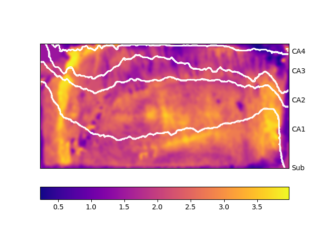
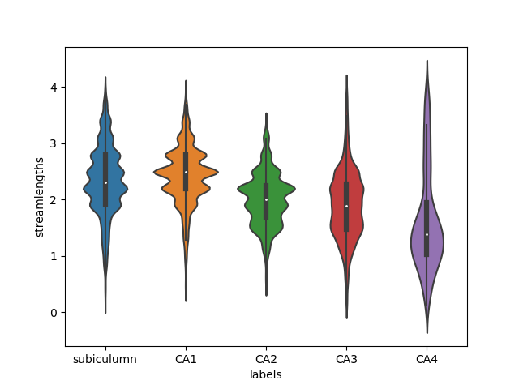

# snakemake_hippocampal_unfolding

   This is a pipeline for visualizing output of [hippocampal autotop pipeline by Jordan Dekraker](https://github.com/jordandekraker/Hippocampal_AutoTop).

## Example output
   Quality control gif images:
   
           
   
   Unfolded Maps plotted (thickness):
   
   
   
   Violin Group plot (thickness):
   
        
   
   Lineplot Group plot (thickness):
   
   
   
### Other output include
- npz files for each subject containing unfolded maps
- pkl and csv file containing flattened unfolded maps in convient format for comparison

## Requirements
1. Snakemake [installation instructions](https://snakemake.readthedocs.io/en/stable/getting_started/installation.html)
2. [Gif your nifti](https://github.com/miykael/gif_your_nifti) singularity container --> https://hub.docker.com/r/kaitj/gif_your_nifti 
     
     `singularity pull docker://kaitj/gif_your_nifti`
3. Python packages
- pandas
- numpy
- matplotlib
- seaborn
- scipy
- sci-kit image
- sci-kit learn
## Usage
1. Populate participant_id.tsv file with subjects to be run in pipeline
2. Populate config.yaml file with appropriate features for your dataset:
  ##### config.yaml
```
participant_tsv: participant_id.tsv
input_dir: /home/myousif9/scratch/hcp_unfolding3_jdkrek                                     <-- top level directory for your dataset
boundary: /scratch/jdekrake/Hippocampal_AutoTop/misc/BigBrain_ManualSubfieldsUnfolded.mat   <-- do not change this
singularity: /scratch/myousif9/singularity/gif_your_nifit_miykael.sif                       <-- point this to where ever this singularity container is located

coords:
  - AP
  - IO
  - PD

features:         <-- name of features in mat files (add to this if you have more features to unfold)
  - GI
  - streamlengths
  - qMap
  
unfold_mat:       <-- name of mat files without extension (add to this if there is another mat file to unfold)
  - surf

hemi:             <-- list of hemispheres to visualize (add R or L or both R and L)
  - L

cmap: plasma      <-- choose the color map you would like for your unfolded maps 
```
   [link to list of colormaps](https://matplotlib.org/3.1.1/gallery/color/colormap_reference.html)
   
3. Ready to run the pipeline now! 
- Run with by using command `snakemake` or which ever way works for your system or compute cluster etc.
- To generate report by running `snakemake --report`

## Acknowledgements

Thanks to [Roy Haast](https://github.com/royhaast) and [Jason Kai](https://github.com/kaitj) for providing code and help in making this pipeline. 
